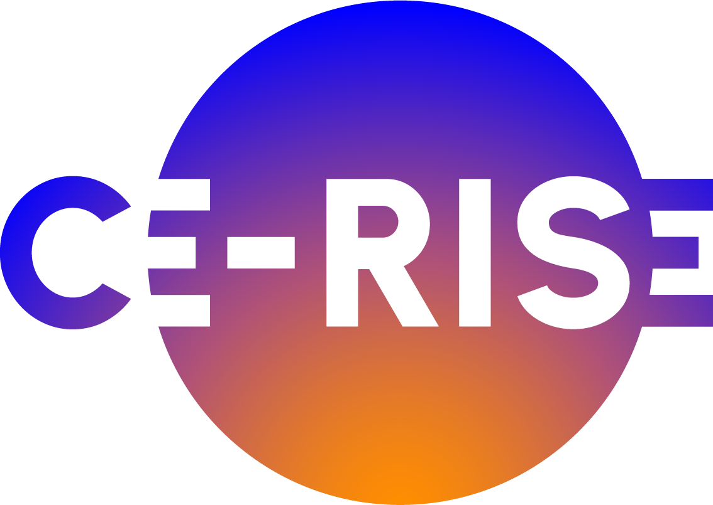

# CE-RISE Digital Passport Engineering Assistant

The CE-RISE Digital Passport Engineering Assistant is a stdio MCP server for AI-assisted reuse of existing CE-RISE Digital Passport assets.

Its purpose is to help users discover CE-RISE components, understand how they fit together, map engineering goals to available capabilities, plan implementation steps, and assess readiness before moving into more specific CE-RISE tools or deployment workflows.

It does not replace CE-RISE services, schemas, methods, documentation, or deployment assets. It guides users toward them.

The main product workflow is general Digital Passport adoption. The assistant should help an organization clarify compliance drivers, value-chain information flows, implementation readiness, and value opportunities from shared information. This workflow is not tied to a company-size label.

## Initial Scope

The first implementation is intentionally small and deterministic:

- a local CE-RISE capability and component catalog;
- a curated connected-source manifest for CE-RISE repositories, documentation, model assets, and service references;
- a read-only live service connection manifest for health, readiness, version, and OpenAPI probes;
- a deployment artifact manifest for Compose and Kubernetes starter outputs derived from the CE-RISE GitOps template;
- a reference-example manifest that treats the local demonstrator as an example to generalize from, not a mandatory target architecture;
- an update channel manifest for optional current release, tag, documentation, and artifact metadata checks;
- MCP tools for discovery, architecture guidance, adoption context assessment, value-chain flow mapping, value-opportunity identification, implementation planning, and readiness checks;
- MCP tools for listing, checking, inspecting, and snapshotting connected CE-RISE sources;
- MCP tools for read-only live service discovery;
- MCP tools for planning, generating, and readiness-checking deployment artifact outputs;
- MCP tools for listing reference examples and generalizing reusable workflow patterns from them;
- MCP tools for optional update-aware context over configured CE-RISE upstream channels;
- MCP resources exposing the catalog, source manifest, live service manifest, deployment artifact manifest, reference-example manifest, update channel manifest, and core scope rule;
- a first design workflow example under `examples/01-design-workflow/`;
- local validation and smoke scripts;
- release-side metadata for OCI image publication and MCP registry publication from the GitHub mirror.

The first server connects to curated CE-RISE repositories and documentation references. It can inspect local sibling repositories when they are available, optionally check remote repository/documentation URL availability, and probe read-only live service discovery endpoints.

It can also return Docker Compose and Kubernetes starter file contents for planning deployment handover. These outputs are derived from the existing CE-RISE GitOps template and are not a replacement deployment framework.

It does not call live CE-RISE business operations such as record creation, validation, query, indicator computation, or registry refresh.

Compliance-oriented outputs are planning aids only. They are not legal certification or legal advice.

## Main Reference

The human-facing CE-RISE solution entry point remains:

- https://solution.ce-rise.eu/

## Local Commands

```bash
./scripts/run-local.sh
./scripts/smoke-mcp.sh
./scripts/smoke-container.sh
./scripts/validate-local.sh
```

## Repository

The canonical repository is maintained on Codeberg:

- https://codeberg.org/CE-RISE-software/dp-engineering-assistant

The published documentation for this MCP server is:

- https://ce-rise-software.codeberg.page/dp-engineering-assistant/

The GitHub mirror is used for release automation, OCI image publication, MCP registry publication, and Zenodo integration.

After release, MCP clients can discover the server through the MCP Registry identity `io.github.CE-RISE-software/dp-engineering-assistant`. When the server is registered behind the CE-RISE MCPO gateway, HTTP/OpenAPI clients can reach it through the gateway endpoint published in this documentation.

---

Funded by the European Union under Grant Agreement No. 101092281 - CE-RISE.

Views and opinions expressed are those of the author(s) only and do not necessarily reflect those of the European Union or the granting authority (HADEA).
Neither the European Union nor the granting authority can be held responsible for them.

<a href="https://ce-rise.eu/" target="_blank" rel="noopener noreferrer">
  
</a>

(c) 2026 CE-RISE consortium.

Licensed under the [European Union Public Licence v1.2 (EUPL-1.2)](https://joinup.ec.europa.eu/collection/eupl/eupl-text-eupl-12).

Attribution: CE-RISE project (Grant Agreement No. 101092281) and the individual authors/partners as indicated.

<a href="https://www.nilu.com" target="_blank" rel="noopener noreferrer">
  
</a>

Developed by NILU (Riccardo Boero - ribo@nilu.no) within the CE-RISE project.
